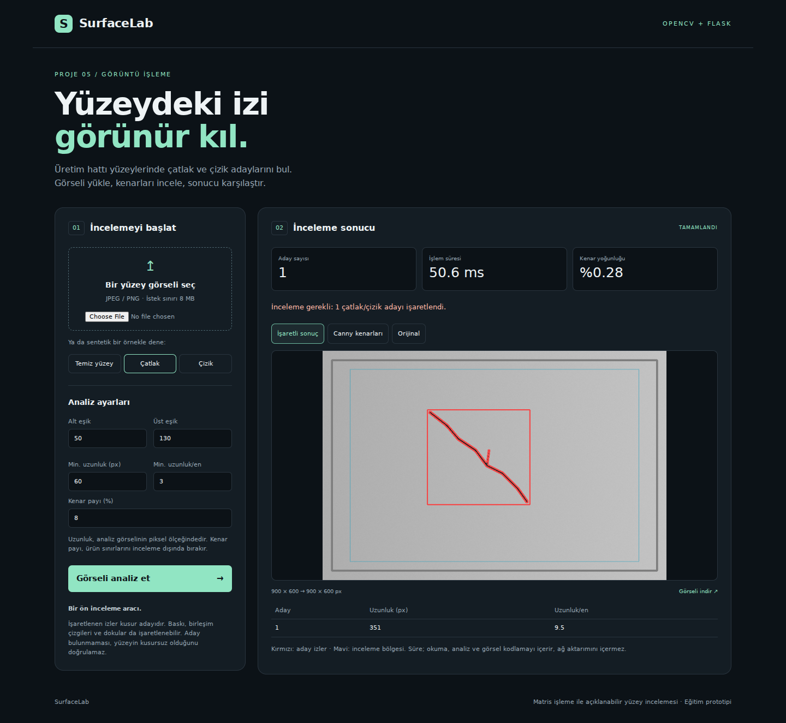
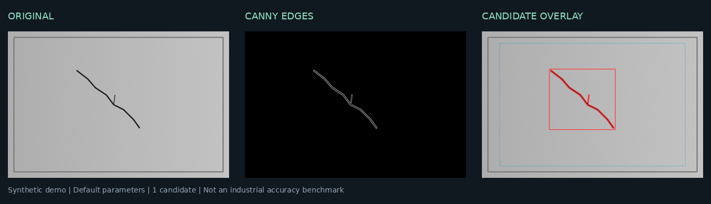

# SurfaceLab — Üretim Hattı Çatlak Dedektörü

**Bir yüzey görselini yükleyin; çatlak ve çizik adaylarını, Canny kenar haritasını ve işaretli sonucu aynı arayüzde inceleyin.**

Proje 5 · Python · OpenCV (Canny) · Flask · NumPy



## Problem ve yaklaşım

Üretimde yüzey üzerindeki ince izleri elle incelemek zaman alır. Bu proje, düşük dokulu ve düz yüzeylerdeki uzun, ince izleri görüntü matrisleri üzerinden bulup gözle kontrol edilebilir hale getiren bir eğitim prototipidir.

Yaklaşım açıklanabilirdir: gri tonlama, Gaussian filtre, Canny, morfolojik kapama ve kontur geometrisi. Eğitim verisi veya öğrenilmiş model gerektirmez. **Canny bir kenar dedektörüdür; işaretlenen her kenar kesin çatlak değildir.** Sonuç bu nedenle “kusurlu/kusursuz” yerine “inceleme gerekli/aday bulunamadı” olarak sunulur.

## Özellikler

- JPEG/PNG yükleme; görselleri diske kaydetmeden bellekte işleme.
- Orijinal, Canny kenarları ve işaretli sonuç arasında geçiş; PNG indirme.
- Ayarlanabilir Canny eşikleri, minimum iz uzunluğu, uzunluk/en oranı ve inceleme bölgesi.
- Aday sayısı, aday geometrisi, kenar yoğunluğu ve ölçülen işlem süresi.
- Dosya seçmeden denenebilen üç sentetik yüzey örneği.
- Masaüstü ve mobil arayüz; aynı algoritmayı kullanan JSON API.
- Girdi doğrulama, istek/piksel sınırları, otomatik testler ve GitHub Actions iş akışı.

## Hızlı başlangıç

Python **3.11 veya 3.12** önerilir. Komutları projenin ana klasöründe çalıştırın.

```bash
python -m venv .venv
```

Sanal ortamı etkinleştirin:

| Ortam | Komut |
| --- | --- |
| Windows PowerShell | `.venv\Scripts\Activate.ps1` |
| Windows CMD | `.venv\Scripts\activate.bat` |
| macOS / Linux | `source .venv/bin/activate` |

```bash
python -m pip install -r requirements.txt
python app.py
```

Tarayıcıda **[http://127.0.0.1:5000](http://127.0.0.1:5000)** adresini açın. “Çatlak” örneğine tıklayın veya kendi yüzey görselinizi yükleyin. Örnek görseller depoda hazırdır; uygulama ilk açılışta veri indirmez.

`opencv-python-headless`, sunucuda pencere açmadan görüntü işleme yapar. Arayüz tarayıcıda çalışır; masaüstü OpenCV penceresi gerekmez. macOS/Linux ortamınızda Python komutu `python3` ise komutlarda onu kullanın.

## Nasıl çalışır?



| Aşama | İşlem | Amaç |
| --- | --- | --- |
| 1. Doğrulama | Dosya formatını ve boyutlarını kontrol et | Geçersiz veya aşırı büyük girdiyi reddet |
| 2. Ölçekleme | Uzun kenarı en fazla 1400 piksele indir | İşlem maliyetini sınırla; küçük görselleri büyütme |
| 3. İnceleme bölgesi | Varsayılan olarak her kenardan %8 çıkar | Ürünün dış sınırlarını inceleme dışında bırak |
| 4. Ön işleme | Gri tonlama + 5×5 Gaussian filtre | Gürültüyü yumuşat |
| 5. Kenar çıkarımı | `cv2.Canny(..., L2gradient=True)` | Yoğunluk değişimlerinden kenar haritası üret |
| 6. Birleştirme | 3×3 çekirdekle morfolojik kapama | Yakın kenar parçalarını birleştir |
| 7. Kontur filtresi | Döndürülmüş dikdörtgenin uzun kenarını ve uzunluk/en oranını ölç | Kısa ve geniş şekilleri ele |
| 8. Sunum | Konturu ve kutuyu kırmızı işaretle | Operatörün adayları incelemesini kolaylaştır |

İnceleme bölgesinin sınırına değen konturlar elenir. Bu tercih panel kenarından gelen yanlış adayları azaltır; sınırdaki gerçek kusurları da kaçırabilir.

### Varsayılan parametreler

| Parametre | Varsayılan | İzin verilen değer | Etkisi |
| --- | ---: | --- | --- |
| `low` | 50 | 0–254; `low < high` | Canny alt eşiği |
| `high` | 130 | 1–255; `high > low` | Canny üst eşiği |
| `min_length` | 60 px | 10–1000 | Aday dikdörtgeninin minimum uzun kenarı |
| `min_elongation` | 3.0 | 1–20 | Minimum uzunluk/en oranı |
| `margin` | %8 | 0–30 | Her kenardan dışlanan oran |

Uzunluk ve kutu koordinatları **ölçeklenmiş analiz görselinde** ölçülür; çatlağın gerçek uzunluğu veya milimetre ölçümü değildir. Farklı çözünürlüklerde aynı fiziksel kusur farklı piksel ölçüsü alabilir. Kesin fiziksel ölçüm için kamera kalibrasyonu gerekir.

## Örnek sonuçlar

Depodaki örnekler `scripts/generate_samples.py` ile sabit rastgelelik tohumu (`42`) kullanılarak üretilmiştir. **Gerçek fabrika görüntüleri değildir.** Varsayılan ayarlarda doğrulanan sonuçlar:

| Görsel | Aday sayısı | Çıktı |
| --- | ---: | --- |
| `samples/clean.png` | 0 | Aday bulunamadı |
| `samples/crack.png` | 1 | İnceleme gerekli |
| `samples/scratch.png` | 1 | İnceleme gerekli |

Bu örnekler akışı gösterir; endüstriyel doğruluk, duyarlılık veya özgüllük ölçümü sunmaz. Arayüzdeki süre her istekte yeniden ölçülür. Süre; dosyanın çözülmesini, analizi ve PNG kodlamasını kapsar, ağ aktarımını kapsamaz.

## API kullanımı

```bash
curl -X POST http://127.0.0.1:5000/api/analyze \
  -F "image=@samples/crack.png" \
  -F "low=50" -F "high=130" \
  -F "min_length=60" -F "min_elongation=3" -F "margin=8"
```

Windows PowerShell'de gerekirse `curl` yerine `curl.exe` kullanın.

| Uç nokta | Yöntem | İşlev |
| --- | --- | --- |
| `/` | GET | Web arayüzü |
| `/health` | GET | `{"status":"ok"}` |
| `/api/analyze` | POST | `multipart/form-data` içindeki `image` dosyasını analiz et |
| `/api/demo/clean` | POST | Temiz yüzey örneğini analiz et |
| `/api/demo/crack` | POST | Çatlak örneğini analiz et |
| `/api/demo/scratch` | POST | Çizik örneğini analiz et |

Başarılı JSON yanıtı `status`, `count`, `candidates`, `roi`, `input_size`, `analysis_size`, `scale`, `elapsed_ms`, `edge_density_percent` ve `images` alanlarını içerir. `images.original`, `images.edges`, `images.overlay` alanları PNG verisinin base64 karşılığıdır. `original`, analiz ölçeğindeki giriş görselidir. Adaylar uzunluklarına göre azalan sırada döner.

Girdi hataları **400**, bilinmeyen örnek **404**, istek boyutu sınırının aşılması **413** döndürür. Doğrulama hataları `{"error":"..."}` biçimindedir. İstek gövdesi sınırı 8 MiB; görsel sınırı 12 milyon piksel; minimum boyut 64×64 pikseldir. İstek sınırı dosyanın yanında form verilerini de kapsar. Görsellerin dosya uzantısına güvenmek yerine gerçek format ve içerik kontrol edilir.

## Testler ve doğrulama

```bash
python -m pip install -r requirements-dev.txt
python -m pytest -q
```

Hazırlama ortamında **Python 3.12 ile 16 test geçti**. Testler temiz/çatlak/çizik ayrımını sentetik örneklerde, yükleme yolunu, hatalı dosyaları, hatalı parametreleri, istek ve piksel sınırlarını, büyük görsel ölçeklemesini, kısa iz filtresini ve bölge sınırı filtresini kapsar.

`.github/workflows/tests.yml`, depoya push veya pull request geldiğinde Python 3.11 ile testleri çalıştıracak şekilde tanımlanmıştır. GitHub üzerindeki çalışma sonucu, depoya yükleme sonrası Actions sekmesinden görülebilir.

Tarayıcı doğrulamasında örnek analizi, dosya yükleme, Canny görünümüne geçiş ve hatalı eşik mesajı kontrol edildi. 390 piksel genişliğindeki mobil görünümde yatay taşma ve JavaScript hatası görülmedi. [Mobil ekran görüntüsü](docs/mobile.png).

Örnek görselleri yeniden üretmek için:

```bash
python scripts/generate_samples.py
```

## Kodun düzeni

| Dosya / klasör | Sorumluluk |
| --- | --- |
| `app.py` | Flask uygulaması, uç noktalar ve HTTP hata yönetimi |
| `detector.py` | Görsel doğrulama, Canny hattı, kontur filtresi ve sonuç üretimi |
| `templates/index.html` | Arayüzün yapısı |
| `static/` | CSS ve JavaScript; harici arayüz bağımlılığı yok |
| `samples/` | Yeniden üretilebilir sentetik örnekler |
| `scripts/generate_samples.py` | Örnek üretimi |
| `tests/test_app.py` | Algoritma ve API regresyon testleri |
| `docs/` | Gerçek uygulama ekran görüntüleri ve işlem çıktısı |
| `.github/workflows/` | Sürekli test iş akışı |

## Sınırlar ve sonraki adım

- **Kamera veya bant entegrasyonu yoktur.** Bu sürüm tek görsel yükleme ile yüzey incelemesidir; çalışan bir fabrika otomasyonu değildir.
- Yazı, panel birleşimi, yansıma ve doku yanlış aday üretebilir. Düşük kontrastlı, kısa, geniş veya sınıra yakın kusurlar kaçabilir.
- Bağlantılı bir iz tek aday, kopuk bir iz birkaç aday sayılabilir. Aday sayısı fiziksel kusur sayısının garantisi değildir.
- Çatlak ve çizik arasında sınıflandırma yapılmaz; uzun ince kenar kümeleri ortak aday sınıfındadır. Güven yüzdesi üretilmez.
- Parametreler yüzey ve aydınlatma koşuluna göre ayarlanmalıdır. Gerçek kullanım için etiketli görüntülerle doğrulama gerekir.
- Flask geliştirme sunucusu yerel demo içindir. Bu sürüm kimlik doğrulama, eşzamanlı işlem kuyruğu veya üretim dağıtımı içermez.

Sonraki geliştirme: sabit kamera ve aydınlatmayla görüntü toplamak, gerçek kusurları etiketlemek, yanlış alarm/kaçırma oranını ölçmek ve ardından video akışı ile ürün takibini eklemek.

## Kaynaklar

- [OpenCV — Canny Edge Detection](https://docs.opencv.org/4.10.0/da/d22/tutorial_py_canny.html)
- [Flask — Uploading Files](https://flask.palletsprojects.com/en/stable/patterns/fileuploads/)

## Lisans

Bu proje [MIT lisansı](LICENSE) ile sunulur.
